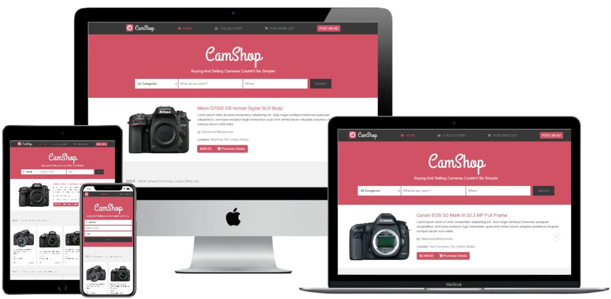
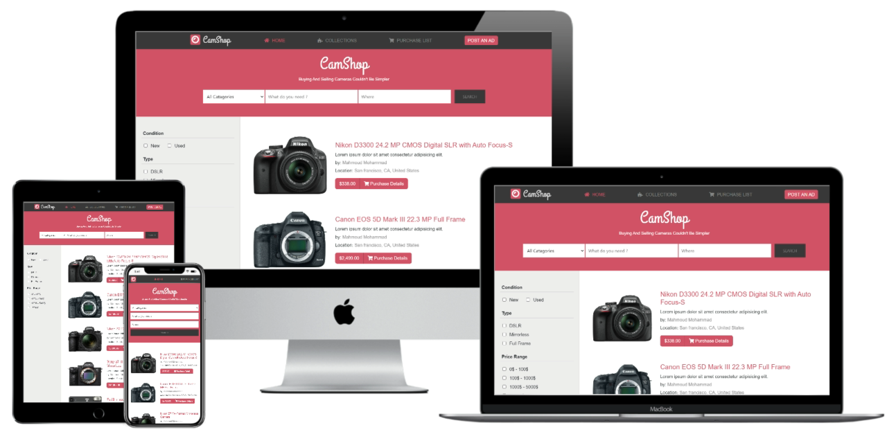

!

# Online shop (index and search page) - Built time 16 hours

> This is a capstone/exam project for the [Microverse](https://www.microverse.org) module HTML/CSS. It is a Crafts(handmades) website using HTML, CSS3/SCSS, Bootstrap, and Font awesome.

## Watch a video presentation of the project [here](https://www.loom.com/share/277d684f83bb4885a067be4ae40a20fe). The website is built using this [mockup](https://www.behance.net/gallery/24796463/ZATTIX)

## Screenshot of the index page

## Screenshot of the search page

The project is built using HTML and CSS/SCSS with an extensive use of the grid and flex propreties. I used all SCSS core functionality: variables, mixins and color functions.

## Built With

- HTML
- CSS3/SCSS
- Bootstrap
- Font awesome icons
- Webhint/Stylelint linters
- NPM scripts for testing and running the SCSS changes

## Used techniques
 
- made a main page logo that's responsive and changes with different sizes.
- A bootstrap Carousel on the top section of the main page to show the most wanted items.
- in the Search section i Used flex box to give it a different layout at each screen size.
- Used Css grid in the main section.
- Used bootstrap cards in the Css grid to give the content a professional look.
- inside each card i used flex box to auto align the images with the description giving it a professional look.
- Used media queries to give the pages a responsive layout that looks good on all screen sizes.

## Live Demo

[Live Demo index page](https://raw.githack.com/mahmoud717/HTML-CSS-capstone-project-Online-shop/development-branch/index.html)

[Live Demo search page](https://raw.githack.com/mahmoud717/HTML-CSS-capstone-project-Online-shop/development-branch/search.html)

(You can also navigate between pages using the  search form.)

## To get a local copy up and running follow these simple example steps.

### Setup

- Clone the project locally by downloading the zip file or by the  link provided in the repo.

### Linters
1. install node.js
2. run `npm install`.
3. run `npm run test` to check the Html and Css files.

### Deployment

Install and run a live server plugin on you IDE/Text editor and run it from the root directory.

## Author

👤 **Mahmoud Mohammad**

- Github: [@githubhandle](https://github.com/mahmoud717)
- Twitter: [@twitterhandle](https://twitter.com/mahmoud26369406)

## Show your support

Give a ⭐️ if you like this project!

## 📝 License

This project is [MIT](lic.url) licensed.
